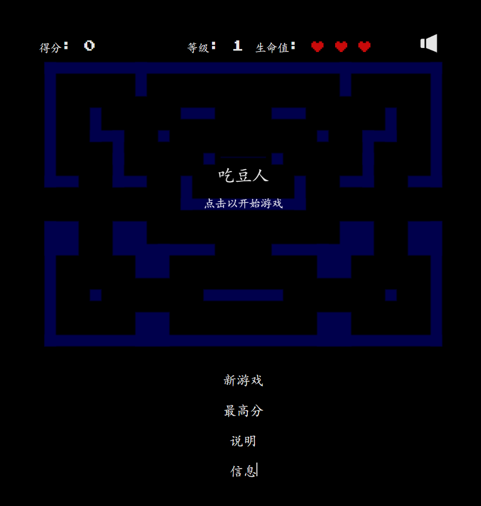

# pacman-canvas 吃豆人

Disclaimer 免责声明
----------

> I am currenty migrating this project to Typescript and React.  
> 我目前正在将此项目迁移到 TypeScript 和 React。  
> You can check it out at https://github.com/platzhersh/pacman-canvas-next (work in progress).  
> 你可以在 https://github.com/platzhersh/pacman-canvas-next 查看（正在开发中）。  
> I will most probably not further update this repository.  
> 我很可能不会再更新这个仓库。

Description 描述
-----------

An old classic, re-written in HTML5.  
一个古老的经典游戏，用 HTML5 重新编写。  
Visit http://pacman.platzh1rsch.ch to see it live.  
访问 http://pacman.platzh1rsch.ch 可以实时查看。

Sounds from 声音来源  
http://soundfxcenter.com/ 和 http://soundfxnow.com/

If you like this project, feel free to buy me a coffee:  
如果你喜欢这个项目，欢迎给我买杯咖啡：

<a href="https://www.buymeacoffee.com/platzh1rsch" target="_blank"></a>

---

## 汉化说明

当前汉化仅适用于 版本：

首先感谢原作者的开源。[原项目地址](https://github.com/platzhersh/pacman-canvas)

具体汉化了那些内容，请参考[翻译说明](./翻译说明.md)。

我看不懂代码，所以只做汉化，有问题，请到原作者仓库处反馈。

本人提供这个项目在 NAS、服务器等的有偿远程部署服务，有需要可联系。  
微信号 `E-0_0-`  
闲鱼搜索用户 `明月人间`  
或者邮箱 `firfe163@163.com`  
如果这个项目有帮到你。欢迎start。

有其他的项目的汉化需求，欢迎提issue。或其他方式联系通知。

### 部署汉化项目

1. 从阿里云或华为云镜像仓库拉取镜像，注意填写镜像标签，镜像仓库中没有`latest`标签

   ```bash
   docker pull swr.cn-north-4.myhuaweicloud.com/firfe/pacman-1:1.0.6
   ```

2. 部署  
   容器内部端口 3000
     - 命令部署

       ```bash
       docker run -d \
       --name pacman-1 \
       --network bridge \
       --restart always \
       --log-opt max-size=1m \
       --log-opt max-file=3 \
       -p 3000:3000 \
       swr.cn-north-4.myhuaweicloud.com/firfe/pacman-1:1.0.6
       ```

     - `compose.yaml`文件部署 👍推荐

       ```yaml
       #version: '3.9'
       services:
         pacman-1:
           container_name: pacman-1
           image: swr.cn-north-4.myhuaweicloud.com/firfe/pacman-1:1.0.6
           network_mode: bridge
           restart: always
           logging:
             options:
               max-size: 1m
               max-file: '3'
           ports:
             - 3000:3000
       ```
## 修改说明

这里对除了汉化之外的代码修改的说明。  
增加修改部分具体见 [修改说明](./修改说明.md)。

`./README.md` 文件翻译，增加 `## 汉化说明`、`## 修改说明`、`## 汉化效果截图` 部分。

增加目录 `./图片`
新增文件 `./.dockerignore`、`./Dockerfile`、`./翻译说明.md`、`./修改说明.md`  

## 汉化效果截图




# License 许可证

<p xmlns:cc="http://creativecommons.org/ns#" xmlns:dct="http://purl.org/dc/terms/"><a property="dct:title" rel="cc:attributionURL" href="https://github.com/platzhersh/pacman-canvas">pacman-canvas</a> by <a rel="cc:attributionURL dct:creator" property="cc:attributionName" href="https://github.com/platzhersh">Platzh1rsch</a> is marked with <a href="LICENSE.md" target="_blank" rel="license noopener noreferrer" style="display:inline-block;">CC0 1.0 Universal</a></p>
pacman-canvas 由 Platzh1rsch 标记为 CC0 1.0 Universal（公共领域贡献）。

# Get started 快速开始

To just run the game locally, run `npm start`.
If you want to see the console logs in your browser, use the `npm run start:dev` instead.  
要仅在本地运行游戏，请运行以下命令：`npm start`如果你想在浏览器中查看控制台日志，请使用以下命令代替：`npm run start:dev`

To modify the game for your needs, look at the `pacman-canvas.js` file and make your modifications.  
要根据你的需求修改游戏，请查看 pacman-canvas.js 文件并进行修改。  
To change the look and feel, edit the `pacman-canvas.css` file or also the `index.htm`file, where everything comes together.  
要更改外观和风格，请编辑 pacman-canvas.css 文件，或者编辑 index.html 文件（所有内容都在这里整合在一起）。

---

# Version history 版本历史

_Version 1.0.6 - 14.08.2022_

- adjust license 调整许可证
- update npm dependencies 更新 npm 依赖项

_Version 1.0.5 - 22.03.2021_

- add webpack config 添加 Webpack 配置
- fix finished game state 修复游戏结束状态的问题
- show console logs when started locally 在本地启动时显示控制台日志

_Version 1.0.4 - 26.12.2020_

- remove highscore reset endpoint 移除最高分重置端点

_Version 1.0.3 - 26.12.2020_

- fix speed issue 修复速度问题

_Version 1.0.2 - 26.12.2020_

- add get started section in README 在 README 中添加“快速开始”部分
- limit to 10 levels for now 暂时限制为 10 个关卡
- small refactorings 小规模重构
- add score validation in JS 在 JavaScript 中添加分数验证

_Version 1.0.1 - 6.10.2020_

- add `bump-version.sh` to make versioning easier

_Version 1.0.0 - 5.9.2020_

- use "default" version number format, go up to 1.0.0
- add `package.json`
- add `server.js`
- you can now run pacman running an express JS server, using `npm start`
- don't use ajax `async: false` anymore to load map config, since it has been marked as deprecated

_Version 0.93 - 8.1.2020_

- add `ads.txt`

_Version 0.92 - 6.3.2018_

- remove navigator.vibrate() calls

_Version 0.91 - 15.01.2016_

- more tests to avoid cheaters
- better highscore form validation
- timer integrated (not in use yet)
- "your screen is too small to play in landscape view" message removed
- fix number of points for eating a ghost

_Version 0.9 - 15.10.2015_

- different difficulties depending on level
- scatter / chase indicated through wall colour
- extended instructions

_Version 0.87 - 08.10.2015_

- fix a bug that allowed resuming a game after game over

_Version 0.86 - 25.05.2015_

- some security fixes to avoid cheaters from adding highscores

_Version 0.84 - 09.11.2014_

- fixed bug that caused game to crash when leaving game area to the right side while holding the right arrow

_Version 0.83 - 07.05.2014_

- not possible to stop by turning into walls anymore
- mute / unmute the game by pressing the "M" key

_Version 0.82 - 02.04.2014_

- small bugfixes
- swipe gestures detection on the whole screen not only game area

_Version 0.81 - 16.03.2014_

- Ghost Modes Scatter & Chase
- Pathfinding AI for Blinky
- Ghosts need to return to Ghost House when dead

_Version 0.8 - 13.11.2013_

- lots of small changes in the backend
- when you go in landscape mode and your screen is too small to display the whole site, you get notified to rotate your phone into portrait mode
- all onClick and onMousedown in HTML removed and replaced by EventListeners in JavaScript
- Pacman Canvas now uses ApplicationCache to cache its content, so you can play the game offline!

_Version 0.78 - 05.11.2013_

- navigation via buttons should be less delayed by using onMouseDown event instead of onClick
- refreshRate is now a game attribute and could be changed easily during the game (not yet implemented in frontend)

_Version 0.77 - 24.05.2013_

- Ghosts start to blink before to undazzle
- Pacman now dies with style

_Version 0.76 - 02.05.2013_

- You can now use the usual arrow keys to control pacman
- fixed 2 small bugs regarding KeyEvents

_Version 0.75 - 28.04.2013_

- You can pause / resume the game by pressing SPACE
- ESC is no longer used to pause / resume, but to go back to the main view
- Game Menu only showing while game is paused
- some css tweaks
- Simple Highscore implemented using Ajax, Json and Sqlite3

_Version 0.74 - 25.04.2013_

- You can pause / resume the game by pressing ESC or clicking into canvas
- Swipe Gestures using hammerjs
- replaced alerts by nice html overlay messages

_Version 0.73 - 17.04.2013_

- You can play on until you lost all your 3 lives
- Ghosts state gets reset everytime they get eaten or new level starts

_Version 0.72 - 30.01.2013_

- Ghost Base Door
- Reset Game after winning

_Version 0.71 - 30.01.2013_

- Ghosts can die too

_Version 0.7 - 29.01.2013_

- Powerpills & Beastmode

_Version 0.63 - 29.01.2013_

- Pills now get loaded over external json file (map.json)
- ghost collisions implemented -> dying
- tried to clean up the code a bit

_Version 0.62 - 23.01.2013_

- disable zoom on Mobile
- change name to Pacman Canvas (Alpha)

_Version 0.61 - 12.01.2013_

- all walls defined (incl. collisions)

_Version 0.6 - 12.01.2013_

- small fixes for mobile view
- sound control (default: muted)
- collision control for walls
- json datastructure design for all game objects (pills, magic pills, walls)

_Version 0.41 - 10.12.2012_

- Mobile Design Fix
- New Icon

_Version 0.40 - 08.12.2012_

- Control Buttons for mobile
- Small Design Updates

_Version 0.30 - 05.12.2012_

- Touch Support via jGestures
- Responsive

_Version 0.20 - 22.11.2012_

- Code Refactored for further development
- Sound added
- Appcache implemented

_Version 0.13 - 29.10.2012_

- Never miss a dot: Pacman now always stays in the grid.

_Version 0.12 - 19.10.2012_

- Pacman is now able to eat the dots. Eating a dot equals 10 points for now.
- LiveScore implemented.
- Game ends when all dots are eaten.

_Version 0.11 - 15.10.2012_

- Placing white Dots and storing them in a Hashtable
- Monster/Ghost Prototype
- Score Prototype
- Pacman had to get smaller (r=15px)
- Display Grid
- Refactoring HTML

_Version 0.10 - 23.08.2012_

- Started cleaning up the code using Objects
- Pacman now turns around when changing directions
